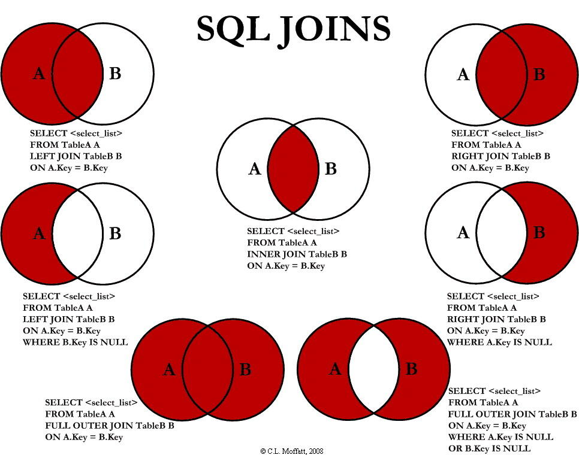

``` sql

-- 查看最大连接数
show variables like '%max_connections%'

--  show status like 'Threads%';
---- Thread_cached 		客户端断开，此线程会缓存，为下一个连接提供服务
---- Threads_connected  打开的连接数
---- Threads_created   创建过的线程数
---- Threads_running 1 	激活的连接数

-- 查询连接列表
show processlist;

-- 查询当前连接数
select ip ,count(ip) as ip_uses from (
	select substring_index(host,':' ,1) as ip from information_schema.processlist where db = 'camp2.0'
) as c group by ip order by ip_uses desc;


-- 
show variables like '%slow_query_log%'
-- 开启慢查询
set global slow_query_log=1;

```


### SQL JOINS



+ inner join

+ left join
+ right join
+ full join


+ UNION 与 UNION ALL:
```sql
-- A 表和B表 在name 字段 唯一化 的所有数据，也就是所有A.name 加B.name 不重复
SELECT name FROM TableA UNION SELECT name FROM TableB

-- A.name +B.name 可以重复
SELECT name FROM TableA UNION ALL SELECT name FROM TableB

```

参考： [图解SQL的inner join、left join、right join、full outer join、union、union all的区别](https://www.cnblogs.com/logon/p/3748020.html)


### sql时间

sql 时间比较：
```sql

-- 日期格式化
select date_format(now(),'%Y-%m-%d');

-- timestamp 转bigInt
select UNIX_TIMESTAMP('2019-03-07 18:00:00');

-- bigInt 转timestamp
select FROM_UNIXTIME(1551952800);

```


```sql
-- 实战
create table money_order(
	id int primary key auto_increment,
	create_at timestamp,
	moneys float,
	uid int
);

insert into money_order values(null,'2018-09-10 00:20:30',15.8,577);
insert into money_order values(null,'2018-09-10 05:20:30',30.9,577);
insert into money_order values(null,'2018-09-10 09:10:30',300,577);

insert into money_order values
	(null,'2018-09-10 09:10:30',300,666),
	(null,'2018-09-10 09:10:40',300,666),
	(null,'2018-09-10 09:20:40',1300,666),
	(null,'2018-09-10 09:30:10',3400,666);


insert into money_order values
	(null,'2018-09-10 09:10:30',30,123),
	(null,'2018-09-10 09:10:40',30,123),
	(null,'2018-09-10 09:10:40',800,123),
	(null,'2018-09-10 09:10:40',100,123);

insert into money_order values
	(null,'2018-09-10 09:10:30',100,222),
	(null,'2018-09-10 09:10:40',100,222),
	(null,'2018-09-18 09:10:40',100,222);

insert into money_order values
	(null,'2018-09-13 09:10:30',100,222),
	(null,'2018-09-11 09:10:40',100,222),
	(null,'2018-09-19 09:10:40',100,222);

-- 查询 2018-09-10 号 充值前3 的用户
select uid,sum(moneys) mey from money_order 
	where date_format(create_at,"%Y-%m-%d")='2018-09-10'
	group by(uid) order by mey desc limit 3;

-- 查询各个金额段的充值人数
select count(uid),(case 
	when (sum_money<500) then '0-500'
	when (sum_money>=500 and sum_money<1000) then '500-1000'
	when (sum_money>=1000 and sum_money<2000) then '1000-2000'
	else '>2000' end) as sum_money from (
	select uid,sum(moneys) sum_money from money_order
		group by(uid) order by sum_money
	) sm
	group by (case 
		when (sum_money<500) then '0-500'
		when (sum_money>=500 and sum_money<1000) then '500-1000'
		when (sum_money>=1000 and sum_money<2000) then '1000-2000'
		else '>2000' end);

```


### timestamp 和datatime

TIMESTAMP和DATETIME的相同点：

+ 两者都可用来表示YYYY-MM-DD HH:MM:SS[.fraction]类型的日期。

TIMESTAMP和DATETIME的不同点：

+ 两者的存储方式不一样
对于TIMESTAMP，它把客户端插入的时间从当前时区转化为UTC（世界标准时间）进行存储。查询时，将其又转化为客户端当前时区进行返回。
而对于DATETIME，不做任何改变，基本上是原样输入和输出。