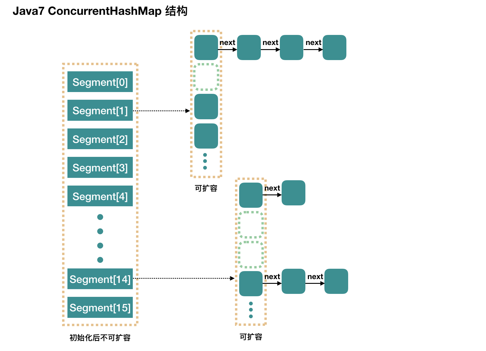
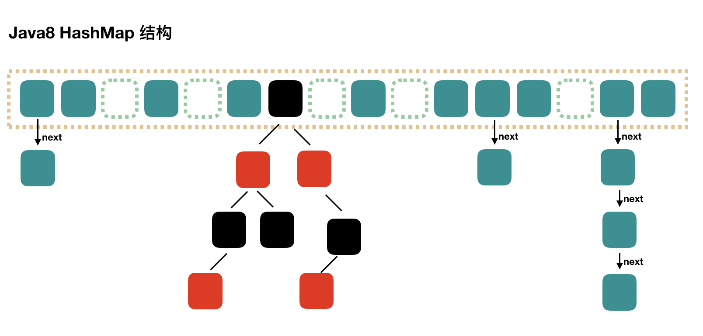
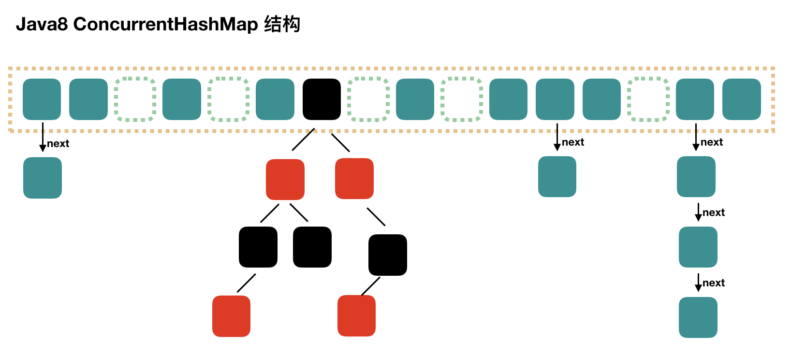

[TOC]

## fail-fast or fail-safe


+ fail-fast: 线程不安全，java.utils下的包都是fail-fast
+ fail-safe: 基于快照的线程安全，可以理解为读写分离

COW家族：Copy-On-Write, `读写分离`，如果是写操作，先复制一个集合，在新集合里操作，修改完再修改引用；用于实现`高并发对COW读和遍历`，不需要加锁；要尽量减少写的次数，改用批量写；fail-safe.


## Collections

### ArrayList扩展: 右移一位

也就是每次0.5倍

```java
 int newCapacity = oldCapacity + (oldCapacity >> 1);
```

### Arrays.asList 是适配器模式

只是把传进来的数组包装了一下，所以不能对数组对象做改变数目的操作，只能修改槽位上的值。


这里的ArrayList是Arrays的内部类， 并非彼ArrayList哦
```java
    public static <T> List<T> asList(T... a) {
        return new ArrayList<>(a);
    }

    /**
     * @serial include
     */
    private static class ArrayList<E> extends AbstractList<E>
            implements RandomAccess, java.io.Serializable
    {
        ...
    }
```


**数组 to 集合 的正确用法**：

```
List<String> strings = new ArrayList<>(Arrays.asList(arr));
```
### 线程安全包装


Collections.synchronizedXXX线程安全包装类是怎么实现的?


+ 默认的锁就是this，还可以在创建时指定锁。
+ 通过把list所有已知的方法都用synchronized关键字包装起来，从而达到串行访问。

#### 使用示范

```java{.line-numbers}
        ArrayList<Integer> list = new ArrayList<>();
        List<Integer> integers = Collections.synchronizedList(list);
```


#### 函数定义
```java{.line-numbers}
    //根据指定的list返回一个线程安全的list。
    public static <T> List<T> synchronizedList(List<T> list) {
        return (list instanceof RandomAccess ?
                new SynchronizedRandomAccessList<>(list) :
                new SynchronizedList<>(list));
    }
```

#### 源码分析

SynchronizedRandomAccessList,这个是一个静态内部类，父类是SynchronizedList,再上面的父类是SynchronizedList，再上面就是SynchronizedCollection

```java
    static class SynchronizedCollection<E> implements Collection<E>, Serializable {
        final Object mutex;     // 同步代码块 的锁对象，可以指定

        SynchronizedCollection(Collection<E> c) {
            this.c = Objects.requireNonNull(c);
            mutex = this;   // 默认是自己，另一个构造函数里可以指定
        }
        ...
        public int size() {
            // 在这里用同步代码块 ，使用mutex锁住代码
            synchronized (mutex) {return c.size();}
        }
        public boolean add(E e) {
            synchronized (mutex) {return c.add(e);}
        }
        public boolean remove(Object o) {
            synchronized (mutex) {return c.remove(o);}
        }
        //省略...
    }
```


## Map


### HashMap 扩展

一般来说是成倍扩展

threshold： 可用容量	[ˈθreʃhəuld]
loadFactor：装载因子，就是负载率，大多数时候loadFactor=threshold/capacity
capacity: 总容量

```java

    /** 
     * 初始化表大小或使表大小加倍:
     *  老容量没办法调大：可用阀值直接调节
     *  threshold 没给：直接用默认的
     *  一般情况：阀值成倍调大
     *  capacity为空：按照 threshold*loadFactor
     */
    final Node<K,V>[] resize() {
        Node<K,V>[] oldTab = table;
        //旧的容量；old capacity
        int oldCap = (oldTab == null) ? 0 : oldTab.length; 
        // 旧的可用阀值
        int oldThr = threshold;
        int newCap, newThr = 0;
        if (oldCap > 0) {
            // 老容量已经达到容量限制， 可用阀值直接调节到最大
            if (oldCap >= MAXIMUM_CAPACITY) {
                threshold = Integer.MAX_VALUE;
                return oldTab;
            }
            // 成倍扩展，如果在合理范围内
            else if ((newCap = oldCap << 1) < MAXIMUM_CAPACITY &&
                     oldCap >= DEFAULT_INITIAL_CAPACITY)
                newThr = oldThr << 1; // double threshold
        }
        else if (oldThr > 0) // oldCap<=0, oldThr>0, initial capacity was placed in threshold
            newCap = oldThr;
        else {               // zero initial threshold signifies using defaults
            newCap = DEFAULT_INITIAL_CAPACITY;     // 16
            newThr = (int)(DEFAULT_LOAD_FACTOR * DEFAULT_INITIAL_CAPACITY);// 0.75*16=12
        }
        if (newThr == 0) {
            float ft = (float)newCap * loadFactor;
            newThr = (newCap < MAXIMUM_CAPACITY && ft < (float)MAXIMUM_CAPACITY ?
                      (int)ft : Integer.MAX_VALUE);
        }
        threshold = newThr;

        //创建实际的存储结构
       ...
```

###  HashMap 的线程不安全


JDK1.7 下：

+ 高并发下，HashMap将导致`死链`，耗尽CPU
    + 主要原因：transfer方法，多线程对 老table 的entry.next 的并发修改
+ 高并发下,HashMap 容易`丢失数据`，主要就是 存在不同的数据版本
    + 并发赋值时被覆盖
    + 已遍历区间新增元素会丢失
    + “新表” 被覆盖 `table=newTable`;

### HashMap线程不安全的场景

+ 多个线程`同时读写`某个槽位
+ `扩容和读写并行`
    可能导致数据丢失，因为JDK1.7扩容是整个copy 后修改table的指向，如果这果过程对老的table修改，新的table可能同步不到；JDK1.8 先修改后copy
+ 多个线程`同时扩容`，导致不可预料的情况发生


### ConcurrentHashMap

 ConcurrentHashMap 如何实现线程安全？


+ 核心思想是减小锁的粒度


#### JDK1.7的实现




##### 基本思想

+ 划分出很多个`Segment`，每次锁对应的Segment
+ 大量利用volatile，final，CAS等lock-free技术来减少锁竞争对于性能的影响，
    + 利用`volatile`：保证读取对象的可见性
    + 利用原子操作`CAS(Compare and Swap)`：保证写入的原子性
+ ConcurrentHashMap并不允许key或者value为null


##### 源码分析

```java
    public V put(K key, V value) {
        Segment<K,V> s;
        if (value == null)
            throw new NullPointerException();

        //得到hash值
        int hash = hash(key);
        // 获取到段号
        int j = (hash >>> segmentShift) & segmentMask;

        if ((s = (Segment<K,V>)UNSAFE.getObject          // nonvolatile; recheck
        (segments, (j << SSHIFT) + SBASE)) == null) //  in ensureSegment
             //段为空，创建段
            s = ensureSegment(j);

        return s.put(key, hash, value, false);
    }
```
volatile: [ˈvɒlətaɪl]  

为了保证创建时的线程安全，采用了`volatile`和`CAS`操作

```java

    private Segment<K,V> ensureSegment(int k) {
        //省略...
            if ((seg = (Segment<K,V>)UNSAFE.getObjectVolatile(ss, u))
                == null) { // recheck
                Segment<K,V> s = new Segment<K,V>(lf, threshold, tab);
                while ((seg = (Segment<K,V>)UNSAFE.getObjectVolatile(ss, u))
                       == null) {
                    if (UNSAFE.compareAndSwapObject(ss, u, null, seg = s))
                        break;
                }
            }

```

对元素操作前，先上锁
```java
        final V put(K key, int hash, V value, boolean onlyIfAbsent) {

            //尝试获取锁
            //tryLock:如果当前线程可以得到锁，返回true
            //scanAndLockForPut：
            HashEntry<K,V> node = tryLock() ? null :   scanAndLockForPut(key, hash, value);
            
            V oldValue;
            try {
                HashEntry<K,V>[] tab = table;
                int index = (tab.length - 1) & hash;
                HashEntry<K,V> first = entryAt(tab, index);
                for (HashEntry<K,V> e = first;;) {
                    //省略...
                }
            } finally {
                //释放锁
                unlock();
            }
            return oldValue;
        }
```


#### JDK 1.8的实现







##### 基本思想
+ 基本节点Node是线程安全的，基于`final`和`volatile`
+ 锁的粒度是`Node`，每次只锁住一个槽位
+ `CAS`保证原子操作：put方法调用 casTabAt，对应compareAndSwapObject
+ `volatile`保证可见性：get方法调用tabAt,对应getObjectVolatile
+ 尽量少，短的syn同步代码块保证`锁定是短暂的`


```java
    /**
     * Node 类是线程安全的
     *  - hash 和 key 是final，不可变；
     *  - val and next 是volatile的，不可能存在中间状态；
     *  - 多线程安全，主要关注状态空间和后验条件，这里是满足的
     */
    static class Node<K,V> implements Map.Entry<K,V> {
        final int hash;
        final K key;
        volatile V val;
        volatile Node<K,V> next;

        Node(int hash, K key, V val, Node<K,V> next) {
            this.hash = hash;
            this.key = key;
            this.val = val;
            this.next = next;
        }
        //省略...
```

这里Node 还分了好几种：

+ Node: 普通节点
+ ReservationNode: 主要是用来占位,当得知key不存在，在还未插入的间隙会先锁住这个槽位。
+ TreeBin: 红黑树节点
+ FrowardingNode: 转发节点，扩容过程，把落到这个节点的请求转发到新数组的对应位置


参考：
+ 《码出高效，Java开发手册》，from阿里巴巴，6.8相关章节

##### 源码分析：put 方法

```java

    /** 
     * put 方法，如果不存在就创建节点
    Implementation for put and putIfAbsent */
    final V putVal(K key, V value, boolean onlyIfAbsent) {
        if (key == null || value == null) 
            throw new NullPointerException();
        //获得hash
        int hash = spread(key.hashCode());
        int binCount = 0;
        
        //table是volitate的，垃圾箱，第一次使用时创建
        //transient volatile Node<K,V>[] table;
        for (Node<K,V>[] tab = table;;) {
            
            Node<K,V> f;
            int n, i, fh;
            
            if (tab == null || (n = tab.length) == 0)
                tab = initTable();
            
            // 没有 节点
            else if ((f = tabAt(tab, i = (n - 1) & hash)) == null) {
                //cas 操作，分配内存
                if (casTabAt(tab, i, null,
                             new Node<K,V>(hash, key, value, null)))
                    break; // 添加新的节点不需要锁住，cas操作
            }
            else if ((fh = f.hash) == MOVED)
                tab = helpTransfer(tab, f);
            else {
                V oldVal = null;
                synchronized (f) { // 锁住节点
                    // 对接点做处理
                    if (tabAt(tab, i) == f) {
                        // 链表节点
                        if (fh >= 0) {
                            ...
                        }//树节点
                        else if (f instanceof TreeBin) {
                            ...
                        }
                    }
                }
                if (binCount != 0) {
                    // 超过8 ，list to tree
                    if (binCount >= TREEIFY_THRESHOLD)
                        
                        treeifyBin(tab, i);
                    if (oldVal != null)
                        return oldVal;
                    break;
                }
            }
        }
        addCount(1L, binCount);
        return null;
    }

    //CAS操作
    static final <K,V> boolean casTabAt(Node<K,V>[] tab, int i,
                                        Node<K,V> c, Node<K,V> v) {
        return U.compareAndSwapObject(tab, ((long)i << ASHIFT) + ABASE, c, v);
    }
```

binCount 阀值 用于区分使用list还是tree存储；

添加的节点<binCount:list
添加的节点>binCount: tree
>  The bin count threshold for using a tree rather than list for a  bin.  Bins are converted to trees when adding an element to a  bin with at least this many nodes. The value must be greater than 2, and should be at least 8 to mesh with assumptions in  tree removal about conversion back to plain bins upon  shrinkage.


##### 源码分析：get 方法

```java

    /**
     * 获取对象
     */
    public V get(Object key) {
        Node<K,V>[] tab; 
        Node<K,V> e, p;
        int n, eh;
        K ek;
        //获得hash
        int h = spread(key.hashCode());
        //如果表已创建
        if ((tab = table) != null && (n = tab.length) > 0 &&
            (e = tabAt(tab, (n - 1) & h)) != null) {
            if ((eh = e.hash) == h) {
                if ((ek = e.key) == key || (ek != null && key.equals(ek)))
                    return e.val;
            }
            else if (eh < 0)
                return (p = e.find(h, key)) != null ? p.val : null;
            while ((e = e.next) != null) {
                if (e.hash == h &&
                    ((ek = e.key) == key || (ek != null && key.equals(ek))))
                    return e.val;
            }
        }
        return null;
    }

    //保证读取可见性
    @SuppressWarnings("unchecked")
    static final <K,V> Node<K,V> tabAt(Node<K,V>[] tab, int i) {
        return (Node<K,V>)U.getObjectVolatile(tab, ((long)i << ASHIFT) + ABASE);
    }

```


#### 在JDK1.7 and JDK1.8 上对比
JDK1.7 和JDK1.8 在ConcurrentHashMaps上的对比：

+ 实现原理：
    * 1.7 
        - 是基于段(`Segment`)实现并发的，`并发受到段数量限制`
        - Segment 继承ReentrantLock[^]来实现锁
    * 1.8 
        - 基于UNSAFE提供的原子操作`CAS`，`volitile`
        - 使用`synchronized`实现锁 ，JDK1.8对 synchronized的优化已经等于或优于ReentrantLock了


+ 锁的粒度：
    * 1.7: 锁在`Segment` 上，相对1.8比较粗糙
    * 1.8: 锁在`Node`上，对应一个hash，更加精细
+ 复杂程度：
    * 1.7: 简单，代码量1600+
    * 1.8: 复杂，代码量6300+

+ 退化问题：
    * 1.7
        - 同一hash以链表解决冲突，
        - 过多equals不同而hash相同的对象时，查找`退化为二维数组`查找
        - 节点上查找时间复杂度$O(n)$
    * 1.8 
        - 同一个hash上链表长度过大（默认>8）时,会转为红黑树
        - 红黑树查找时间复杂度在$O(log(n))$级别


参考:
+ [Java7/8 中的 HashMap 和 ConcurrentHashMap 全解析](http://www.importnew.com/28263.html)


### ConcurrentHashMap and HashMap 对比


HashMap:
+ 线程不安全，单线程效率高
+ key 可以为null，不建议为null


ConcurrentHashMap:
+ 线程安全，效率相对较低
+ key 不可为null


参考：
[ConcurrentHashMap学习](http://hill007299.iteye.com/blog/1490779)


### 补充知识：读音

+ synchronized: 同步的 ['sɪŋkrənaɪzd]
+ Segment: 段，[ 'segm(ə)nt ]
+ Reentrant Lock: 可重入锁，[riː'entrənt]


