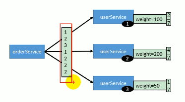
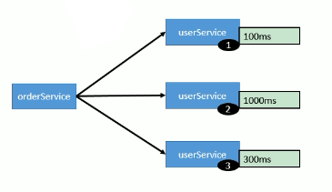
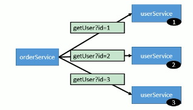
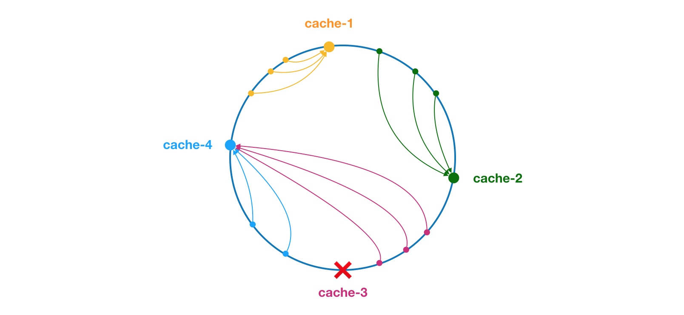
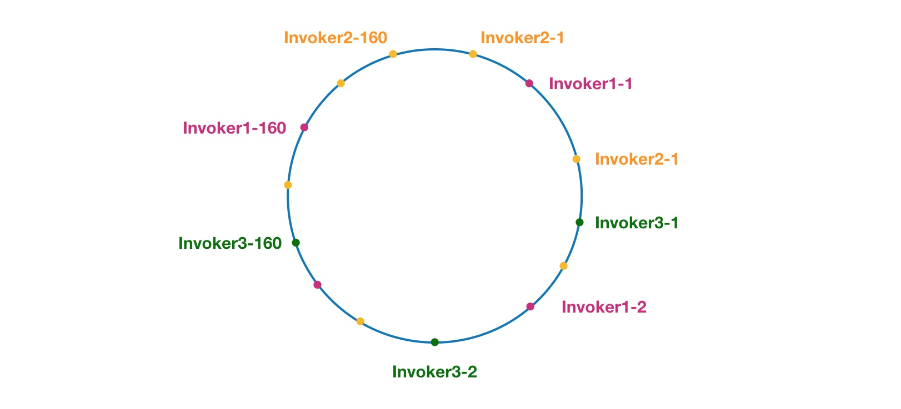

[TOC]

Apache Dubbo


> Dubbo是 阿里巴巴公司开源的一个高性能优秀的服务框架，使得应用可通过高性能的 RPC 实现服务的输出和输入功能，可以和 Spring框架无缝集成。


1. 远程通讯: 提供对多种基于长连接的`NIO框架`抽象封装，包括多种线程模型，序列化，以及“`请求-响应`”模式的信息交换方式。
2. 集群容错: 提供`基于接口方法`的透明远程过程调用，包括`多协议支持`，以及`软负载均衡`，`失败容错`，`地址路由`，`动态配置`等集群支持。
3. `自动发现`: 基于注册中心目录服务，使服务消费方能动态的查找服务提供方，使地址透明，使服务提供方可以`平滑增加或减少`机器。


## 为什么要用dubbo


当服务越来越多后，服务之间的依赖关系越来越复杂，服务 URL 配置管理变得非常困难另外还需要统计服务的调用量来进行分析，这些需求都可以使用dubbo来满足。


### Dubbo和Spring Cloud

+ Spring Cloud功能上是Dubbo的超集，Dubbo只实现服务治理，其他如服务网关，分布式配置，批量任务等，需要嵌入其他工具来实现


+ 通信协议：
    + Dubbo 支持多种通信协议，默认采用Dubbo，长连接短报文，通信速度上略胜 Spring Cloud。
    + Spring Cloud默认rest通信

## dubbo架构


0. `Container` 负责加载，启动 `Provider` 
1. `Provider` 启动时向 `Registry` 注册自己提供的服务
2. `Consumer` 启动后向 `Registry` 订阅 自己所需的服务
3. `Registry` 返回 `Provider` 列表给 `Consumer`，如果 `Provider` 有变更，基于长连接推送
4. `Consumer` 基于软负载均衡算法，从 `Provider` 列表中选出一台进行调用，如果调用失败，再换一台
5. `Consumer` 和 `Provider` 在内存中维护调用次数和调用时间，定时(每分钟)发送给 `Monitor` 


### 注册中心


注册中心用来注册服务，哪一个服务由哪一个机器来提供必需让调用者知道，简单来说就是IP地址和服务名称的对应关系。 
dubbo官方提供了几种实现注册中心的方式： 

1. Multicast 注册中心 
2. Zookeeper 注册中心 
3. Redis 注册中心 
4. Simple 注册中心

官方明确推荐使用Zookeeper 注册中心的方式，Dubbo 原生支持的Redis 方案需要服务器时间同步，且性能消耗过大。针对分布式领域著名的CAP理论（C——数据一致性，A——服务可用性，P——服务对网络分区故障的容错性），Zookeeper 保证的是CP ，但对于服务发现而言，可用性比数据一致性更加重要 ，而 Eureka 设计则遵循AP原则 。


### zookeeper 注册中心

Zookeeper 是 Apacahe Hadoop 的子项目，是一个树型的目录服务，支持变更推送，适合作为 Dubbo 服务的注册中心，工业强度较高，可用于生产环境，并推荐使用 。


流程说明：

+ `Provider` 启动时: 向 /dubbo/com.foo.BarService/providers 目录下写入自己的 URL 地址
+ `Consumer` 启动时: 订阅 /dubbo/com.foo.BarService/+ providers 目录下的`Provider URL 地址`。并向 /dubbo/com.foo.BarService/consumers 目录下写入自己的 URL 地址
+ 监控中心启动时: 订阅 /dubbo/com.foo.BarService 目录下的所有`Provider`和`Consumer` URL 地址。


支持以下功能：

+ 当`Provider`出现断电等异常停机时，`Registry`能自动删除`Provider`信息
+ 当`Registry`重启时，能`自动恢复注册数据`，以及`订阅请求`
+ 当会话过期时，能自动恢复注册数据，以及订阅请求
+ 当设置 <dubbo:registry check="false" /> 时，记录失败注册和订阅请求，后台定时重试
+ 可通过 <dubbo:registry username="admin" password="1234" /> 设置 zookeeper 登录信息
+ 可通过 <dubbo:registry group="dubbo" /> 设置 zookeeper 的根节点，不设置将使用无根树
+ 支持 * 号通配符 <dubbo:reference group="*" version="*" />，可订阅服务的所有分组和所有版本的

参考：[zookeeper 注册中心](http://dubbo.apache.org/zh-cn/docs/user/references/registry/zookeeper.html)

### Redis 注册中心


使用 `Redis` 的 Key/Map 结构存储数据结构：
+ 主 Key 为服务名和类型
+ Map 中的 Key 为 URL 地址
+ Map 中的 Value 为过期时间，用于判断脏数据，脏数据由监控中心删除

使用 Redis 的 Publish/Subscribe 事件通知数据变更：

+ 通过事件的值区分事件类型：register, unregister, subscribe, unsubscribe
+ 普通消费者直接订阅指定服务提供者的 Key，只会收到指定服务的 register, unregister 事件
+ 监控中心通过 psubscribe 功能订阅 /dubbo/*，会收到所有服务的所有变更事件


调用过程：

0. 服务提供方启动时，向 Key:/dubbo/com.foo.BarService/providers 下，添加当前提供者的地址
1. 并向 Channel:/dubbo/com.foo.BarService/providers 发送 register 事件
2. 服务消费方启动时，从 Channel:/dubbo/com.foo.BarService/providers 订阅 register 和 unregister 事件
并向 Key:/dubbo/com.foo.BarService/consumers 下，添加当前消费者的地址
3. 服务消费方收到 register 和 unregister 事件后，从 Key:/dubbo/com.foo.BarService/providers 下获取提供者地址列表
4. 服务监控中心启动时，从 Channel:/dubbo/* 订阅 register 和 unregister，以及 subscribe 和unsubsribe事件
5. 服务监控中心收到 register 和 unregister 事件后，从 Key:/dubbo/com.foo.BarService/providers 下获取提供者地址列表
6. 服务监控中心收到 subscribe 和 unsubsribe 事件后，从 Key:/dubbo/com.foo.BarService/consumers 下获取消费者地址列表


Redis方案要求服务器时间同步且存在性能消耗过大的缺点


参考：[Redis 注册中心](http://dubbo.apache.org/zh-cn/docs/user/references/registry/redis.html)


粘包，半包???


## 自动注册/发现、负载均衡等服务化特性

### Dubbo负载均衡策略


服务框架常见负载均衡实现方案包括：集中式、分布式，分布式又可分进程内、分进程两种。Dubbo采用的是`服务发现`和`负载均衡`共同集成在`consumer端`的分布式进程内解决方案


负载均衡策略上Dubbo原生提供的有基于权重随机负载、最少活跃数优先、Roundrobin、一致性Hash等几个方案。

5VJ2k5k%


#### Random LoadBalance: 基于权重的随机负载均衡

RandomLoadBalance 是加权随机算法的具体实现，它的算法思想很简单。假设我们有一组服务器 servers = [A, B, C]，他们对应的权重为 weights = [5, 3, 2]，权重总和为10。现在把这些权重值平铺在一维坐标值上，[0, 5) 区间属于服务器 A，[5, 8) 区间属于服务器 B，[8, 10) 区间属于服务器 C。接下来通过随机数生成器生成一个范围在 [0, 10) 之间的随机数，然后计算这个随机数会落到哪个区间上。比如数字3会落到服务器 A 对应的区间上，此时返回服务器 A 即可。权重越大的机器，在坐标轴上对应的区间范围就越大，因此随机数生成器生成的数字就会有更大的概率落到此区间内。只要随机数生成器产生的随机数分布性很好，在经过多次选择后，每个服务器被选中的次数比例接近其权重比例。比如，经过一万次选择后，服务器 A 被选中的次数大约为5000次，服务器 B 被选中的次数约为3000次，服务器 C 被选中的次数约为2000次。


```java
public class RandomLoadBalance extends AbstractLoadBalance {

    public static final String NAME = "random";

    private final Random random = new Random();

    @Override
    protected <T> Invoker<T> doSelect(List<Invoker<T>> invokers, URL url, Invocation invocation) {
        int length = invokers.size();
        int totalWeight = 0;
        boolean sameWeight = true;
        // 下面这个循环有两个作用，第一是计算总权重 totalWeight，
        // 第二是检测每个服务提供者的权重是否相同
        for (int i = 0; i < length; i++) {
            int weight = getWeight(invokers.get(i), invocation);
            // 累加权重
            totalWeight += weight;
            // 检测当前服务提供者的权重与上一个服务提供者的权重是否相同，
            // 不相同的话，则将 sameWeight 置为 false。
            if (sameWeight && i > 0
                    && weight != getWeight(invokers.get(i - 1), invocation)) {
                sameWeight = false;
            }
        }
        
        // 下面的 if 分支主要用于获取随机数，并计算随机数落在哪个区间上
        if (totalWeight > 0 && !sameWeight) {
            // 随机获取一个 [0, totalWeight) 区间内的数字
            int offset = random.nextInt(totalWeight);
            // 循环让 offset 数减去服务提供者权重值，当 offset 小于0时，返回相应的 Invoker。
            // 举例说明一下，我们有 servers = [A, B, C]，weights = [5, 3, 2]，offset = 7。
            // 第一次循环，offset - 5 = 2 > 0，即 offset > 5，
            // 表明其不会落在服务器 A 对应的区间上。
            // 第二次循环，offset - 3 = -1 < 0，即 5 < offset < 8，
            // 表明其会落在服务器 B 对应的区间上
            for (int i = 0; i < length; i++) {
                // 让随机值 offset 减去权重值
                offset -= getWeight(invokers.get(i), invocation);
                if (offset < 0) {
                    // 返回相应的 Invoker
                    return invokers.get(i);
                }
            }
        }
        
        // 如果所有服务提供者权重值相同，此时直接随机返回一个即可
        return invokers.get(random.nextInt(length));
    }
}
```
RandomLoadBalance 的算法思想比较简单，在经过多次请求后，能够将调用请求按照权重值进行“均匀”分配。当然 RandomLoadBalance 也存在一定的缺点，当调用次数比较少时，Random 产生的随机数可能会比较集中，此时多数请求会落到同一台服务器上。这个缺点并不是很严重，多数情况下可以忽略。RandomLoadBalance 是一个简单，高效的负载均衡实现，因此 Dubbo 选择它作为缺省实现。


#### RoundRobin LoadBalance 基于权重的轮询



访问是有序的，但是基于权重，如图中，权重2:4:1， 第一轮是1,2,3，后面就是1,2,2,2


#### LeastActive LoadBalance 最少活跃数 


LeastActiveLoadBalance 翻译过来是最小活跃数负载均衡。活跃调用数越小，表明该服务提供者效率越高，单位时间内可处理更多的请求。此时应优先将请求分配给该服务提供者。在具体实现中，每个服务提供者对应一个活跃数 active。初始情况下，所有服务提供者活跃数均为0。每收到一个请求，活跃数加1，完成请求后则将活跃数减1。在服务运行一段时间后，性能好的服务提供者处理请求的速度更快，因此活跃数下降的也越快，此时这样的服务提供者能够优先获取到新的服务请求、这就是最小活跃数负载均衡算法的基本思想。除了最小活跃数，LeastActiveLoadBalance 在实现上还引入了权重值。所以准确的来说，LeastActiveLoadBalance 是基于加权最小活跃数算法实现的。举个例子说明一下，在一个服务提供者集群中，有两个性能优异的服务提供者。某一时刻它们的活跃数相同，此时 Dubbo 会根据它们的权重去分配请求，权重越大，获取到新请求的概率就越大。如果两个服务提供者权重相同，此时随机选择一个即可。


```java
public class LeastActiveLoadBalance extends AbstractLoadBalance {

    public static final String NAME = "leastactive";
    private final Random random = new Random();
    @Override
    protected <T> Invoker<T> doSelect(List<Invoker<T>> invokers, URL url, Invocation invocation) {
        int length = invokers.size();
        // 最小的活跃数
        int leastActive = -1;
        // 具有相同“最小活跃数”的服务者提供者（以下用 Invoker 代称）数量
        int leastCount = 0; 
        // leastIndexs 用于记录具有相同“最小活跃数”的 Invoker 在 invokers 列表中的下标信息
        int[] leastIndexs = new int[length];
        int totalWeight = 0;
        // 第一个最小活跃数的 Invoker 权重值，用于与其他具有相同最小活跃数的 Invoker 的权重进行对比，
        // 以检测是否“所有具有相同最小活跃数的 Invoker 的权重”均相等
        int firstWeight = 0;
        boolean sameWeight = true;

        // 遍历 invokers 列表
        for (int i = 0; i < length; i++) {
            Invoker<T> invoker = invokers.get(i);
            // 获取 Invoker 对应的活跃数
            int active = RpcStatus.getStatus(invoker.getUrl(), invocation.getMethodName()).getActive();
            // 获取权重 - ⭐️
            int weight = invoker.getUrl().getMethodParameter(invocation.getMethodName(), Constants.WEIGHT_KEY, Constants.DEFAULT_WEIGHT);
            // 发现更小的活跃数，重新开始
            if (leastActive == -1 || active < leastActive) {
            	// 使用当前活跃数 active 更新最小活跃数 leastActive
                leastActive = active;
                // 更新 leastCount 为 1
                leastCount = 1;
                // 记录当前下标值到 leastIndexs 中
                leastIndexs[0] = i;
                totalWeight = weight;
                firstWeight = weight;
                sameWeight = true;

            // 当前 Invoker 的活跃数 active 与最小活跃数 leastActive 相同 
            } else if (active == leastActive) {
            	// 在 leastIndexs 中记录下当前 Invoker 在 invokers 集合中的下标
                leastIndexs[leastCount++] = i;
                // 累加权重
                totalWeight += weight;
                // 检测当前 Invoker 的权重与 firstWeight 是否相等，
                // 不相等则将 sameWeight 置为 false
                if (sameWeight && i > 0
                    && weight != firstWeight) {
                    sameWeight = false;
                }
            }
        }
        
        // 当只有一个 Invoker 具有最小活跃数，此时直接返回该 Invoker 即可
        if (leastCount == 1) {
            return invokers.get(leastIndexs[0]);
        }

        // 有多个 Invoker 具有相同的最小活跃数，但它们之间的权重不同
        if (!sameWeight && totalWeight > 0) {
        	// 随机生成一个 [0, totalWeight) 之间的数字
            int offsetWeight = random.nextInt(totalWeight);
            // 循环让随机数减去具有最小活跃数的 Invoker 的权重值，
            // 当 offset 小于等于0时，返回相应的 Invoker
            for (int i = 0; i < leastCount; i++) {
                int leastIndex = leastIndexs[i];
                // 获取权重值，并让随机数减去权重值 - ⭐️
                offsetWeight -= getWeight(invokers.get(leastIndex), invocation);
                if (offsetWeight <= 0)
                    return invokers.get(leastIndex);
            }
        }
        // 如果权重相同或权重为0时，随机返回一个 Invoker
        return invokers.get(leastIndexs[random.nextInt(leastCount)]);
    }
}
```

上面代码的逻辑比较多，我们在代码中写了大量的注释，有帮助大家理解代码逻辑。下面简单总结一下以上代码所做的事情，如下：

遍历 invokers 列表，寻找活跃数最小的 Invoker
如果有多个 Invoker 具有相同的最小活跃数，此时记录下这些 Invoker 在 invokers 集合中的下标，并累加它们的权重，比较它们的权重值是否相等
如果只有一个 Invoker 具有最小的活跃数，此时直接返回该 Invoker 即可
如果有多个 Invoker 具有最小活跃数，且它们的权重不相等，此时处理方式和 RandomLoadBalance 一致
如果有多个 Invoker 具有最小活跃数，但它们的权重相等，此时随机返回一个即可
以上就是 LeastActiveLoadBalance 大致的实现逻辑，大家在阅读的源码的过程中要注意区分活跃数与权重这两个概念，不要混为一谈。

以上分析是基于 Dubbo 2.6.4 版本进行的，由于近期 Dubbo 2.6.5 发布了，并对 LeastActiveLoadBalance 进行了一些修改，下面简单来介绍一下修改内容。回到上面的源码中，我们在上面的代码中标注了两个黄色的五角星⭐️。两处标记对应的代码分别如下：


```java
int weight = invoker.getUrl().getMethodParameter(invocation.getMethodName(), Constants.WEIGHT_KEY, Constants.DEFAULT_WEIGHT);
```

```java
offsetWeight -= getWeight(invokers.get(leastIndex), invocation);
```

问题出在服务预热阶段，第一行代码直接从 url 中取权重值，未被降权过。第二行代码获取到的是经过降权后的权重。第一行代码获取到的权重值最终会被累加到权重总和 totalWeight 中，这个时候会导致一个问题。offsetWeight 是一个在 [0, totalWeight) 范围内的随机数，而它所减去的是经过降权的权重。很有可能在经过 leastCount 次运算后，offsetWeight 仍然是大于0的，导致无法选中 Invoker。这个问题对应的 issue 为 #904，并在 pull request #2172 中被修复。具体的修复逻辑是将标注一处的代码修改为：
```java
// afterWarmup 等价于上面的 weight 变量，这样命名是为了强调该变量经过了 warmup 降权处理
int afterWarmup = getWeight(invoker, invocation);
```
另外，2.6.4 版本中的 LeastActiveLoadBalance 还要一个缺陷，即当一组 Invoker 具有相同的最小活跃数，且其中一个 Invoker 的权重值为1，此时这个 Invoker 无法被选中。缺陷代码如下：
```java
int offsetWeight = random.nextInt(totalWeight);
for (int i = 0; i < leastCount; i++) {
    int leastIndex = leastIndexs[i];
    offsetWeight -= getWeight(invokers.get(leastIndex), invocation);
    if (offsetWeight <= 0)    // ❌
        return invokers.get(leastIndex);
}
```
问题出在了offsetWeight <= 0上，举例说明，假设有一组 Invoker 的权重为 5、2、1，offsetWeight 最大值为 7。假设 offsetWeight = 7，你会发现，当 for 循环进行第二次遍历后 offsetWeight = 7 - 5 - 2 = 0，提前返回了。此时，此时权重为1的 Invoker 就没有机会被选中了。该问题在 Dubbo 2.6.5 中被修复了，修改后的代码如下：
```java
int offsetWeight = random.nextInt(totalWeight) + 1;
```





#### ConsistentHash LoadBalance: 一致性hash


一致性 hash 算法由麻省理工学院的 Karger 及其合作者于1997年提出的，算法提出之初是用于大规模缓存系统的负载均衡。它的工作过程是这样的，首先根据 ip 或者其他的信息为缓存节点生成一个 hash，并将这个 hash 投射到 [0, 232 - 1] 的圆环上。当有查询或写入请求时，则为缓存项的 key 生成一个 hash 值。然后查找第一个大于或等于该 hash 值的缓存节点，并到这个节点中查询或写入缓存项。如果当前节点挂了，则在下一次查询或写入缓存时，为缓存项查找另一个大于其 hash 值的缓存节点即可。大致效果如下图所示，每个缓存节点在圆环上占据一个位置。如果缓存项的 key 的 hash 值小于缓存节点 hash 值，则到该缓存节点中存储或读取缓存项。比如下面绿色点对应的缓存项将会被存储到 cache-2 节点中。由于 cache-3 挂了，原本应该存到该节点中的缓存项最终会存储到 cache-4 节点中。



下面来看看一致性 hash 在 Dubbo 中的应用。我们把上图的缓存节点替换成 Dubbo 的服务提供者，于是得到了下图：



这里相同颜色的节点均属于同一个服务提供者，比如 Invoker1-1，Invoker1-2，……, Invoker1-160。这样做的目的是通过引入虚拟节点，让 Invoker 在圆环上分散开来，避免数据倾斜问题。所谓数据倾斜是指，由于节点不够分散，导致大量请求落到了同一个节点上，而其他节点只会接收到了少量请求的情况。比如：


如上，由于 Invoker-1 和 Invoker-2 在圆环上分布不均，导致系统中75%的请求都会落到 Invoker-1 上，只有 25% 的请求会落到 Invoker-2 上。解决这个问题办法是引入虚拟节点，通过虚拟节点均衡各个节点的请求量。


源码查看：http://dubbo.apache.org/zh-cn/docs/source_code_guide/loadbalance.html


### 路由、限流


限流目前支持consumer、provider端并发限流，实际上是基于信号量限制的，以接口粒度分配信号量，当信号量用完新的调用将被拒绝，当业务返回后信号量被释放。

消费端限流应该是为整个提供端集群分配信号量，而Dubbo错误的将信号量分配给单个机器。这个问题目前可以通过下文提到的隔离框架的流控功能来实现。

限流并非精确限制，不应当依赖其实现严格的并发数控制。

> 后端backend服务限流需要业务方合理评估每个接口的流控值，要求对业务量有足够经验值（可能要在多次线上调优后才能最终得出合理的流控值）。考拉内部流控实践证明，对于保证服务稳定性、优先保证重要消费方、实现服务隔离等有着重要的作用。


### 服务动态治理


动态治理本质上是依赖Dubbo`运行期参数的动态调整`，再通用一点其实就是应用的参数动态调整，开源常用的disconf、diamond、archaius等集中配置管理工具都是设计来解决这个问题。Dubbo内部在url参数传递模型基础上实现了一套参数动态配置逻辑，相比于Dubbo的实现，集成disconf等更专业的框架应该是更好的解决方案，或许Dubbo为了一些其他设计目标解除了对一些外部框架的强制依赖。动态治理可以实现从基本参数如timeout、mock到一些高级特性如路由、限流等几乎所有的运行期参数调整。


## 依赖隔离（服务降级）

当应用被设计依赖外部服务时，要始终保持警惕状态：**外部依赖是不稳定的，为此对接外部依赖做好解耦是关键，避免外部接口发生异常拖垮自身系统。** Dubbo提供了超时`timeout机制`作为最基本的解耦措施，同时在接口报错时支持提供`降级的容错逻辑`；除了容错降级，Dubbo进一步支持强制的`短路降级`。


然而在容错降级与短路降级之间，**Dubbo缺乏一种在容错与短路间切换的机制，即自动熔断。** 自动熔断要达到的效果是：`当接口偶然报错时执行容错返回备用数据，而当接口持续大量报错时能自动在消费端对接口调用短路直接返回备用数据，之后持续监测接口可用性，接口恢复后自动恢复调用`。这样能最大限度减少接口异常对消费方的影响，同时也减轻本就处于异常状态的提供端负载。


实现了断功能。两套方案：
1. 自己实现的熔断逻辑；
2. 通过集成hystrix框架实现。


> Hystrix是Netflix在微服务实践中为实现外部依赖解耦而设计的框架，它假设所有的外部依赖（http、MySQL、Redis等等）可能在任何时间出现问题（你甚至可以想像不经意间就使用了一个没有提供超时设置的http客户端）。于任何可能的外部延时造成的阻塞或其他异常，hystix提供了基于线程池隔离的超时机制，新版本在RxJava基础上信号量隔离也同样支持超时。此外框架还支持定制容错逻辑、请求结果缓存、请求合并、消费端线程池隔离等。


### 集群容错


Dubbo 提供了如下的容错机制：

+ Failover Cluster
如果服务提供者调用失败，调用其他服务提供者
+ Failfast Cluster
快速失败，只发起一次调用，失败立即报错。通常用于非幂等性操作的写操作，比如新增记录。
+ Failback Cluster
失败自动恢复，后台记录失败请求，定时重发，常用于消息通知
+ Forking Cluster
并行调用多个服务器，只要一个成功即返回，通常用于实时性要求较高的读操作，但浪费资源，fork=? 设置最大并行数。
+ Broadcast Cluster
广播调用所有提供者，逐个调用，任意一台报错即失败，通常用于通知所有提供者更新缓存或日志等本地资源信息。


## 启动与停机

这里主要关注Dubbo工程启动初始化阶段和停机销毁阶段的一些特性和改进点：
### 延迟暴露

默认Dubbo服务会随着Spring框架的加载逐一完成服务到注册中心的注册（暴露），如果某些服务需要等待资源就位才能暴露，那就需要延时注册。

增加Spring context初始化完成后继续延时等待的配置项

在无特殊配置的情况下，所有的Dubbo服务默认是注册在同一个tcp端口的。而延迟暴露是通过开启新的延时线程实现的，当延时结束时由于多线程并发执行导致多服务随机注册在多个端口。


### 启动预热

一些应用在运行期会通过本地缓存中间结果提升性能，而当此类应用重启时本地缓存数据丢失，如果重启后的机器立即有大量请求导流过来，由于没有缓存加速会导致请求阻塞响应性能降低。通过对重启后的机器设置预热期可有效缓解重启缓存失效问题：具体做法是降低预热期内的机器权重，引导少部分流量到此机器，此机器可以在预热期内逐步建立缓存，待预热期过后恢复正常权重与其他机器平均分摊流量。


### 优雅停机

在集群部署的情况下，单个消费者或提供者机器上下线对整个产品的运转应该是近乎无感知的，Dubbo提供了优雅停机功机制保障在进程关闭前请求都得到妥善处理。


消费方优雅停机：控制不再有新的请求发出；等待已经发出的请求正确返回；释放连接等资源。


提供方优雅停机：通知消费端停止发送请求到当前机器；通知注册中心服务下线；等待已经接收的请求处理完成并返回；释放连接等资源。

> 考拉在每次服务上下线过程中，每个工程总是收到大量的消费方/提供方报出的服务调用异常，经排查是Dubbo优雅停机实现的问题，修复问题后工程上线阶段异常数明显减少。
另外停机阶段总是莫名的收到zk连接为空的异常信息。是由于在通知注册中心服务下线的过程中，Spring销毁线程和jvm hook线程并发执行，导致zk客户端被提前销毁导致抛出异常。


### Provider重启


> 注册中心发送大量服务销毁与注册通知导致consumer工程Full GC。
> 历史原因，考拉内部仍存在一个提供近200个Dubbo服务的单体工程，而每次当这个工程上线时，消费它的consumer工程就会出现频繁Full GC（3-5次，非内存泄露）。
> 
> 是Dubbo为保证高可用而设计的注册中心缓存导致的问题：在每次收到注册中心变更时consumer会在本地磁盘保存一份服务数据副本，由于多注册中心共享同一份缓存文件，为了避免相互覆盖，每个注册中心实例会在收到变更时重新从磁盘加载文件到缓存，和变更数据对比后重新写回磁盘，在近100提供者机器不断重启的过程中，大量的变更通知导致的频繁加载缓存文件占用大量内存导致Full GC。


参考：
+ [网易考拉海购Dubbok框架优化详解](https://blog.csdn.net/u011277123/article/details/54668768)
+ [恕我直言，你可能误解了微服务](https://sq.163yun.com/blog/article/255770823498977280)


## 实战：dubbo


安装：
git clone https://github.com/apache/incubator-dubbo.git
cd incubator-dubbo
运行 dubbo-demo-provider中的org.apache.dubbo.demo.provider.Provider
如果使用Intellij Idea 请加上-Djava.net.preferIPv4Stack=true

配置：
resource/META-INFO.spring/dubbo-demo-provider.xml
修改其中的dubbo:registry，替换成真实的注册中心地址，推荐使用zookeeper


## 类加载器和SPI 


SPI 全称为 Service Provider Interface，是一种服务发现机制。SPI 的本质是将接口实现类的全限定名配置在文件中，并由服务加载器读取配置文件，加载实现类。这样可以在运行时，动态为接口替换实现类。


在 Dubbo 中，所有负载均衡实现类均继承自 AbstractLoadBalance，该类实现了 LoadBalance 接口，并封装了一些公共的逻辑。所以在分析负载均衡实现之前，先来看一下 AbstractLoadBalance 的逻辑。首先来看一下负载均衡的入口方法 select，如下：

```java
@Override
public <T> Invoker<T> select(List<Invoker<T>> invokers, URL url, Invocation invocation) {
    if (invokers == null || invokers.isEmpty())
        return null;
    // 如果 invokers 列表中仅有一个 Invoker，直接返回即可，无需进行负载均衡
    if (invokers.size() == 1)
        return invokers.get(0);
    
    // 调用 doSelect 方法进行负载均衡，该方法为抽象方法，由子类实现
    return doSelect(invokers, url, invocation);
}

protected abstract <T> Invoker<T> doSelect(List<Invoker<T>> invokers, URL url, Invocation invocation);
```

AbstractLoadBalance 除了实现了 LoadBalance 接口方法，还封装了一些公共逻辑，比如服务提供者权重计算逻辑。具体实现如下：

```java
protected int getWeight(Invoker<?> invoker, Invocation invocation) {
    // 从 url 中获取权重 weight 配置值
    int weight = invoker.getUrl().getMethodParameter(invocation.getMethodName(), Constants.WEIGHT_KEY, Constants.DEFAULT_WEIGHT);
    if (weight > 0) {
        // 获取服务提供者启动时间戳
        long timestamp = invoker.getUrl().getParameter(Constants.REMOTE_TIMESTAMP_KEY, 0L);
        if (timestamp > 0L) {
            // 计算服务提供者运行时长
            int uptime = (int) (System.currentTimeMillis() - timestamp);
            // 获取服务预热时间，默认为10分钟
            int warmup = invoker.getUrl().getParameter(Constants.WARMUP_KEY, Constants.DEFAULT_WARMUP);
            // 如果服务运行时间小于预热时间，则重新计算服务权重，即降权
            if (uptime > 0 && uptime < warmup) {
                // 重新计算服务权重
                weight = calculateWarmupWeight(uptime, warmup, weight);
            }
        }
    }
    return weight;
}

static int calculateWarmupWeight(int uptime, int warmup, int weight) {
    // 计算权重，下面代码逻辑上形似于 (uptime / warmup) * weight。
    // 随着服务运行时间 uptime 增大，权重计算值 ww 会慢慢接近配置值 weight
    int ww = (int) ((float) uptime / ((float) warmup / (float) weight));
    return ww < 1 ? 1 : (ww > weight ? weight : ww);
}
```

上面是权重的计算过程，该过程主要用于保证当服务运行时长小于服务预热时间时，对服务进行降权，避免让服务在启动之初就处于高负载状态。服务预热是一个优化手段，与此类似的还有 JVM 预热。主要目的是让服务启动后“低功率”运行一段时间，使其效率慢慢提升至最佳状态。


### zookeeper宕机与dubbo直连

zookeeper宕机与dubbo直连的情况在面试中可能会被经常问到，所以要引起重视。

在实际生产中，假如zookeeper注册中心宕掉，一段时间内服务消费方还是能够调用提供方的服务的，实际上它使用的本地缓存进行通讯，这只是dubbo健壮性的一种提现。


dubbo的健壮性表现：

+ 监控中心宕掉不影响使用，只是丢失部分采样数据
+ 数据库宕掉后，注册中心仍能通过缓存提供服务列表查询，但不能注册新服务
+ 注册中心对等集群，任意一台宕掉后，将自动切换到另一台
+ 注册中心全部宕掉后，服务提供者和服务消费者仍能通过本地缓存通讯
+ 服务提供者无状态，任意一台宕掉后，不影响使用
+ 服务提供者全部宕掉后，服务消费者应用将无法使用，并无限次重连等待服务提供者恢复


注册中心负责服务地址的注册与查找，相当于目录服务，服务提供者和消费者只在启动时与注册中心交互，注册中心不转发请求，压力较小。所以，我们可以完全可以绕过注册中心——采用 dubbo 直连 ，即在服务消费方配置服务提供方的位置信息。

```xml
<dubbo:reference id="userService" 
    interface="com.zang.gmall.service.UserService" url="dubbo://localhost:20880"/>
```


```java
@Reference
(url ="127.0.0.1:20880")
HelloService  helloService;
```