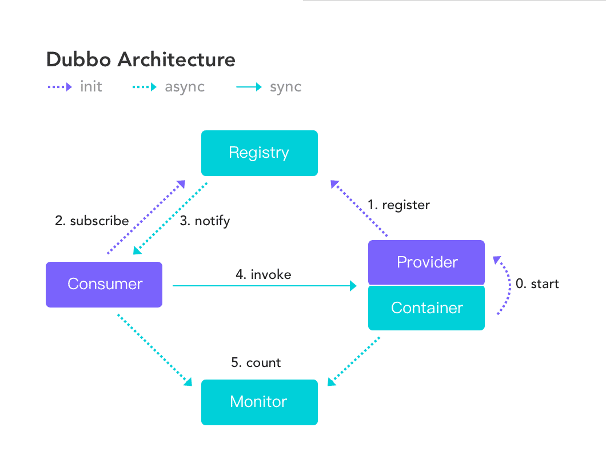
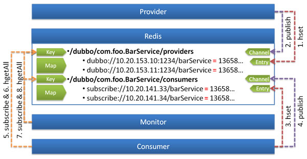
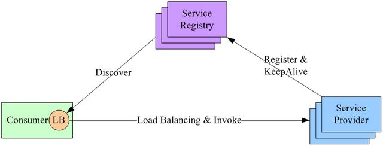

[TOC]

Apache Dubbo

> Dubbo是 阿里巴巴公司开源的一个高性能优秀的服务框架，使得应用可通过高性能的 RPC 实现服务的输出和输入功能，可以和 Spring框架无缝集成。

1. 远程通讯: 提供对多种基于长连接的`NIO框架`抽象封装，包括多种线程模型，序列化，以及“`请求-响应`”模式的信息交换方式。
2. 集群容错: 提供`基于接口方法`的透明远程过程调用，包括`多协议支持`，以及`软负载均衡`，`失败容错`，`地址路由`，`动态配置`等集群支持。
3. `自动发现`: 基于注册中心目录服务，使服务消费方能动态的查找服务提供方，使地址透明，使服务提供方可以`平滑增加或减少`机器。

## 为什么要用dubbo

当服务越来越多后，服务之间的依赖关系越来越复杂，服务 URL 配置管理变得非常困难另外还需要统计服务的调用量来进行分析，这些需求都可以使用dubbo来满足。

## dubbo架构

0. `Container` 负责加载，启动 `Provider` 
1. `Provider` 启动时向 `Registry` 注册自己提供的服务
2. `Consumer` 启动后向 `Registry` 订阅 自己所需的服务
3. Registry 返回 `Provider` 列表给 `Consumer`，如果 `Provider` 有变更，基于长连接推送
4. `Consumer` 基于软负载均衡算法，从 `Provider` 列表中选出一台进行调用，如果调用失败，再换一台
5. `Consumer` 和 `Provider` 在内存中维护调用次数和调用时间，定时(每分钟)发送给 `Monitor` 

### 注册中心

一个完整的dubbo应该是包括注册中心的。 
注册中心用来注册服务和进行负载均衡，哪一个服务由哪一个机器来提供必需让调用者知道，简单来说就是IP地址和服务名称的对应关系。 
dubbo官方提供了几种实现注册中心的方式： 
1. Multicast 注册中心 
2. Zookeeper 注册中心 
3. Redis 注册中心 
4. Simple 注册中心

另外官方明确推荐使用Zookeeper 注册中心的方式。 

### zookeeper 注册中心

Zookeeper 是 Apacahe Hadoop 的子项目，是一个树型的目录服务，支持变更推送，适合作为 Dubbo 服务的注册中心，工业强度较高，可用于生产环境，并推荐使用 。

流程说明：

+ `Provider` 启动时: 向 /dubbo/com.foo.BarService/providers 目录下写入自己的 URL 地址
+ `Consumer` 启动时: 订阅 /dubbo/com.foo.BarService/+ providers 目录下的`Provider URL 地址`。并向 /dubbo/com.foo.BarService/consumers 目录下写入自己的 URL 地址
+ 监控中心启动时: 订阅 /dubbo/com.foo.BarService 目录下的所有`Provider`和`Consumer` URL 地址。

支持以下功能：

+ 当`Provider`出现断电等异常停机时，`Registry`能自动删除`Provider`信息
+ 当`Registry`重启时，能`自动恢复注册数据`，以及`订阅请求`
+ 当会话过期时，能自动恢复注册数据，以及订阅请求
+ 当设置 <dubbo:registry check="false" /> 时，记录失败注册和订阅请求，后台定时重试
+ 可通过 <dubbo:registry username="admin" password="1234" /> 设置 zookeeper 登录信息
+ 可通过 <dubbo:registry group="dubbo" /> 设置 zookeeper 的根节点，不设置将使用无根树
+ 支持 * 号通配符 <dubbo:reference group="*" version="*" />，可订阅服务的所有分组和所有版本的

Dubbo 实践通常以ZooKeeper 为注册中心（Dubbo 原生支持的Redis 方案需要服务器时间同步，且性能消耗过大）。针对分布式领域著名的CAP理论（C——数据一致性，A——服务可用性，P——服务对网络分区故障的容错性），Zookeeper 保证的是CP ，但对于服务发现而言，可用性比数据一致性更加重要 ，而 Eureka 设计则遵循AP原则 。

作者：网易云
链接：https://www.zhihu.com/question/45413135/answer/226794957
来源：知乎
著作权归作者所有。商业转载请联系作者获得授权，非商业转载请注明出处。

参考：[zookeeper 注册中心](http://dubbo.apache.org/zh-cn/docs/user/references/registry/zookeeper.html)

### Redis 注册中心

使用 `Redis` 的 Key/Map 结构存储数据结构：
+ 主 Key 为服务名和类型
+ Map 中的 Key 为 URL 地址
+ Map 中的 Value 为过期时间，用于判断脏数据，脏数据由监控中心删除

使用 Redis 的 Publish/Subscribe 事件通知数据变更：

+ 通过事件的值区分事件类型：register, unregister, subscribe, unsubscribe
+ 普通消费者直接订阅指定服务提供者的 Key，只会收到指定服务的 register, unregister 事件
+ 监控中心通过 psubscribe 功能订阅 /dubbo/*，会收到所有服务的所有变更事件

调用过程：

0. 服务提供方启动时，向 Key:/dubbo/com.foo.BarService/providers 下，添加当前提供者的地址
1. 并向 Channel:/dubbo/com.foo.BarService/providers 发送 register 事件
2. 服务消费方启动时，从 Channel:/dubbo/com.foo.BarService/providers 订阅 register 和 unregister 事件
并向 Key:/dubbo/com.foo.BarService/consumers 下，添加当前消费者的地址
3. 服务消费方收到 register 和 unregister 事件后，从 Key:/dubbo/com.foo.BarService/providers 下获取提供者地址列表
4. 服务监控中心启动时，从 Channel:/dubbo/* 订阅 register 和 unregister，以及 subscribe 和unsubsribe事件
5. 服务监控中心收到 register 和 unregister 事件后，从 Key:/dubbo/com.foo.BarService/providers 下获取提供者地址列表
6. 服务监控中心收到 subscribe 和 unsubsribe 事件后，从 Key:/dubbo/com.foo.BarService/consumers 下获取消费者地址列表

Redis方案要求服务器时间同步且存在性能消耗过大的缺点

参考：[Redis 注册中心](http://dubbo.apache.org/zh-cn/docs/user/references/registry/redis.html)

粘包，半包

## 自动注册/发现、负载均衡等服务化特性

### Dubbo负载均衡策略

服务框架常见负载均衡实现方案包括：集中式、分布式，分布式又可分进程内、分进程两种。Dubbo采用的是`服务发现`和`负载均衡`共同集成在`consumer端`的分布式进程内解决方案

负载均衡策略上Dubbo原生提供的有基于权重随机负载、最少活跃数优先、Roundrobin、一致性Hash等几个方案。

在实际应用中，为了能对个别错误率较高的异常provider做到及时发现、及时引流，Dubbok增加了新的负载均衡策略，在支持权重的基础上自动发现异常provider，异常期自动减流、正常后自动恢复流量。

### 路由、集群容错、限流

和负载均衡策略一样，Dubbo的路由方案是集成在消费端的，加上集群容错功能客户端相对是一个重量的功能封装。可选方案是将路由工作移到注册中心完成（这要求注册中心具有较强的可定制性，不仅路由像权限控制、服务过滤、环境隔离等都可由注册中心集成）

限流目前支持consumer、provider端并发限流，实际上是基于信号量限制的，以接口粒度分配信号量，当信号量用完新的调用将被拒绝，当业务返回后信号量被释放。

消费端限流应该是为整个提供端集群分配信号量，而Dubbo错误的将信号量分配给单个机器。这个问题目前可以通过下文提到的隔离框架的流控功能来实现。

限流并非精确限制，不应当依赖其实现严格的并发数控制。

后端backend服务限流需要业务方合理评估每个接口的流控值，要求对业务量有足够经验值（可能要在多次线上调优后才能最终得出合理的流控值）。考拉内部流控实践证明，对于保证服务稳定性、优先保证重要消费方、实现服务隔离等有着重要的作用。

### 服务动态治理

动态治理本质上是依赖Dubbo运行期参数的动态调整，再通用一点其实就是应用的参数动态调整，开源常用的disconf、diamond、archaius等集中配置管理工具都是设计来解决这个问题。Dubbo内部在url参数传递模型基础上实现了一套参数动态配置逻辑，个人认为相比于Dubbo的实现，集成disconf等更专业的框架应该是更好的解决方案，或许Dubbo为了一些其他设计目标解除了对一些外部框架的强制依赖。动态治理可以实现从基本参数如timeout、mock到一些高级特性如路由、限流等几乎所有的运行期参数调整。

Dubbo原生在动态配置上存在很多bug，配置不生效或配置规则误读等问题都遇到过，如果你再使用原生Dubbo过程中也遇到任何配置问题，Dubbok应该都已经解决掉了。

## 依赖隔离（服务降级）

当应用被设计依赖外部服务时，要始终保持警惕状态：**外部依赖是不稳定的，为此对接外部依赖做好解耦是关键，避免外部接口发生异常拖垮自身系统。** Dubbo提供了超时`timeout机制`作为最基本的解耦措施，同时在接口报错时支持提供`降级的容错逻辑`；除了容错降级，Dubbo进一步支持强制的`短路降级`。

然而在容错降级与短路降级之间，**Dubbo缺乏一种在容错与短路间切换的机制，即自动熔断。** 自动熔断要达到的效果是：`当接口偶然报错时执行容错返回备用数据，而当接口持续大量报错时能自动在消费端对接口调用短路直接返回备用数据，之后持续监测接口可用性，接口恢复后自动恢复调用`。这样能最大限度减少接口异常对消费方的影响，同时也减轻本就处于异常状态的提供端负载。

Dubbok通过标准SPI的的形式，实现了熔断功能。目前支持两套方案：一套是自己实现的熔断逻辑；一套是通过集成hystrix框架实现。目前支持错误率、最低请求量、熔断时间窗等基本配置，支持将业务异常纳入统计范畴；以上参数均可通过SOA治理平台运行期动态调整；支持外部Dubbo依赖调用的准实时监控。

Hystrix是Netflix在微服务实践中为实现外部依赖解耦而设计的框架，它假设所有的外部依赖（http、MySQL、Redis等等）可能在任何时间出现问题（你甚至可以想像不经意间就使用了一个没有提供超时设置的http客户端）。于任何可能的外部延时造成的阻塞或其他异常，hystix提供了基于线程池隔离的超时机制，新版本在RxJava基础上信号量隔离也同样支持超时。此外框架还支持定制容错逻辑、请求结果缓存、请求合并、消费端线程池隔离等，由于某些功能当前无明确需求或与Dubbo功能设计重合而没有进行集成。

## 启动与停机

这里主要关注Dubbo工程启动初始化阶段和停机销毁阶段的一些特性和改进点：
### 延迟暴露

默认Dubbo服务会随着Spring框架的加载逐一完成服务到注册中心的注册（暴露），如果某些服务需要等待资源就位才能暴露，那就需要延时注册。

增加Spring context初始化完成后继续延时等待的配置项

在无特殊配置的情况下，所有的Dubbo服务默认是注册在同一个tcp端口的。而延迟暴露是通过开启新的延时线程实现的，当延时结束时由于多线程并发执行导致多服务随机注册在多个端口。

### 启动预热

一些应用在运行期会通过本地缓存中间结果提升性能，而当此类应用重启时本地缓存数据丢失，如果重启后的机器立即有大量请求导流过来，由于没有缓存加速会导致请求阻塞响应性能降低。通过对重启后的机器设置预热期可有效缓解重启缓存失效问题：具体做法是降低预热期内的机器权重，引导少部分流量到此机器，此机器可以在预热期内逐步建立缓存，待预热期过后恢复正常权重与其他机器平均分摊流量。

### 优雅停机

在集群部署的情况下，单个消费者或提供者机器上下线对整个产品的运转应该是近乎无感知的，Dubbo提供了优雅停机功机制保障在进程关闭前请求都得到妥善处理。

消费方优雅停机：控制不再有新的请求发出；等待已经发出的请求正确返回；释放连接等资源。

提供方优雅停机：通知消费端停止发送请求到当前机器；通知注册中心服务下线；等待已经接收的请求处理完成并返回；释放连接等资源。

+ 考拉在每次服务上下线过程中，每个工程总是收到大量的消费方/提供方报出的服务调用异常，经排查是Dubbo优雅停机实现的问题，修复问题后工程上线阶段异常数明显减少。

+ 另外停机阶段总是莫名的收到zk连接为空的异常信息。是由于在通知注册中心服务下线的过程中，Spring销毁线程和jvm hook线程并发执行，导致zk客户端被提前销毁导致抛出异常。

### Provider重启

注册中心发送大量服务销毁与注册通知导致consumer工程Full GC。

历史原因，考拉内部仍存在一个提供近200个Dubbo服务的单体工程，而每次当这个工程上线时，消费它的consumer工程就会出现频繁Full GC（3-5次，非内存泄露）。

+ 是Dubbo为保证高可用而设计的注册中心缓存导致的问题：在每次收到注册中心变更时consumer会在本地磁盘保存一份服务数据副本，由于多注册中心共享同一份缓存文件，为了避免相互覆盖，每个注册中心实例会在收到变更时重新从磁盘加载文件到缓存，和变更数据对比后重新写回磁盘，在近100提供者机器不断重启的过程中，大量的变更通知导致的频繁加载缓存文件占用大量内存导致Full GC。

参考：
+ [网易考拉海购Dubbok框架优化详解](https://blog.csdn.net/u011277123/article/details/54668768)
+ [恕我直言，你可能误解了微服务](https://sq.163yun.com/blog/article/255770823498977280)