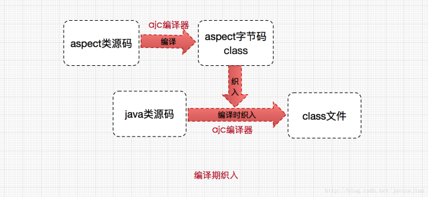
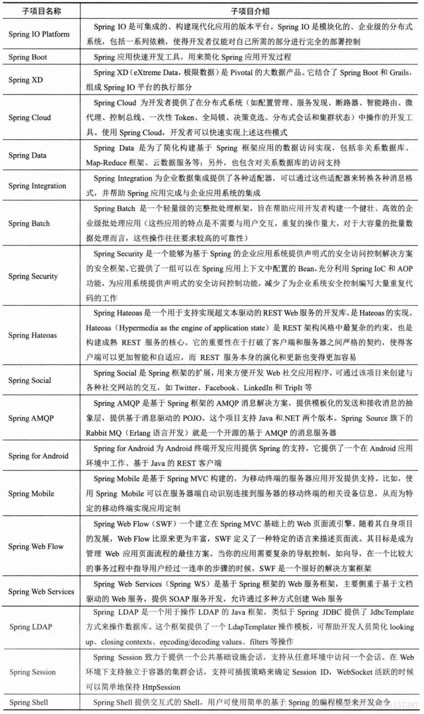

[TOC]


## 企业开发 发展史：


Model1:JSP+JavaBean
Model2:JSP（表现层）+Servlet（页面控制）+JavaBean(业务逻辑)

很多的类只需要一次实例化，比如dao，service，他们都是无状态的；所以我们需要单例。而单例不可避免太多的额外代码。这时候考虑对象池。


Ioc:反射
Aop:代理


## IoC:Inversion of Control

遵循`依赖倒置原则（Dependency Inversion Principle）`,低层依赖上层，面向接口编程

控制反转： 常规情况下，高层依赖了底层，也就控制了低层，现在我们反过来，让底层依赖高层的接口定义（规范）；

依赖注入：把底层注入到高层；这里底层依赖于高层；


参考：[Spring IoC有什么好处呢？](https://www.zhihu.com/search?q=spring&type=content)


控制反转容器(IoC Container):
1. 可以自动对你的代码进行初始化，你只需要维护一个Configuration（可以是xml可以是一段代码）,不需要写一大段初始化代码；

2. 我们在创建实例的时候不需要了解其中的细节，它会自动从高层向下寻找依赖关系，再从底层构建。


## AOP:Aspect Oriented Programming


### 为什么要有AOP

很多的方法中，我们都需要在开始时和结束时做很多相似的工作，如： 数据库连接，数据库断开，打印日志。这些代码导致了核心业务被侵蚀，开发人员花费大量时间在非业务代码上，还是重复的；


这时候就需要Java 的动态代理了, spring 把代理程序在执行核心代码前后的代码“织入”到程序中；

JDK 的`动态代理 Proxy`要跑起来，被代理的类必须实现接口；而对于没有接口实现的Class，可以用CGLib,CGLib采用底层的字节码技术，可以为一个类创建子类，在子类中采用`方法拦截`的技术拦截所有父类方法的调用并顺势的织入横切逻辑。

> AOP（Aspect Oriented Programming）意为：面向切面编程，通过预编译方式和运行期动态代理实现程序功能的统一维护的一种技术。利用AOP可以`对业务逻辑的各个部分进行隔离`，从而使得业务逻辑各部分之间的耦合度降低，提高程序的可重用性，同时提高了开发的效率。


AOP是一种思想，与此对应诞生了AOP联盟。


#### 术语：
+ pointcut：切点，就是需要切入的方法
+ advice:通知，在切点前后执行的方法，before(),after()
+ aspect:切面,before()+切点+after()
+ weaving:切面应用到目标函数的过程称为织入(weaving)。
	+ 动态织入,采用Java的`Proxy`包,Spring 优先采用Proxy
	+ 静态织入，采用`CGLib`,ApectJ优先采用CGLib


### ApectJ 的织入

ApectJ主要采用的是编译期织入，在这个期间使用AspectJ的acj编译器(类似javac)把aspect类编译成class字节码后，在java目标类编译时织入，即先编译aspect类再编译目标类。




## spring 生态



### spring如何管理bean、bean的生命周期


### spring管理的bean有哪些模式，spring默认的是什么模式


### 介绍一下springMVC，springMVC有哪些特性


#### springmvc和spring-boot区别


###  @Autowired的实现原理

自动装配bean


```java

/**
 * Marks a constructor, field, setter method or config method as to be
 * autowired by Spring's dependency injection facilities.
 * 
 * 标记一个构造器，属性，setter方法或者配置方法作为 Spring依赖注入场所
 * <p>Only one constructor (at max) of any given bean class may carry this
 * annotation, indicating the constructor to autowire when used as a Spring
 * bean. Such a constructor does not have to be public.
 *
 * 只有一个构造器可以带有这个annotation，这个构造器不一定要是public
 * <p>Fields are injected right after construction of a bean, before any
 * config methods are invoked. Such a config field does not have to be public.
 * 
 * <p>Config methods may have an arbitrary name and any number of arguments;
 * each of those arguments will be autowired with a matching bean in the
 * Spring container. Bean property setter methods are effectively just
 * a special case of such a general config method. Such config methods
 * do not have to be public.
 *
 * <p>In the case of multiple argument methods, the 'required' parameter is
 * applicable for all arguments.
 *
 * <p>In case of a {@link java.util.Collection} or {@link java.util.Map}
 * dependency type, the container will autowire all beans matching the
 * declared value type. In case of a Map, the keys must be declared as
 * type String and will be resolved to the corresponding bean names.
 *
 * <p>Note that actual injection is performed through a
 * {@link org.springframework.beans.factory.config.BeanPostProcessor
 * BeanPostProcessor} which in turn means that you <em>cannot</em>
 * use {@code @Autowired} to inject references into
 * {@link org.springframework.beans.factory.config.BeanPostProcessor
 * BeanPostProcessor} or
 * {@link org.springframework.beans.factory.config.BeanFactoryPostProcessor BeanFactoryPostProcessor}
 * types. Please consult the javadoc for the {@link AutowiredAnnotationBeanPostProcessor}
 * class (which, by default, checks for the presence of this annotation).
 * 
 * @author Juergen Hoeller
 * @author Mark Fisher
 * @since 2.5
 * @see AutowiredAnnotationBeanPostProcessor
 * @see Qualifier
 * @see Value
 */
@Target({ElementType.CONSTRUCTOR, ElementType.FIELD, ElementType.METHOD, ElementType.ANNOTATION_TYPE})
@Retention(RetentionPolicy.RUNTIME)
@Documented
public @interface Autowired {

	/**
	 * Declares whether the annotated dependency is required.
	 * <p>Defaults to {@code true}.
	 */
	boolean required() default true;

}

```


看到这么一段话：

```java
 * <p>Note that actual injection is performed through a
 * {@link org.springframework.beans.factory.config.BeanPostProcessor
 * BeanPostProcessor} which in turn means that you <em>cannot</em>
 * use {@code @Autowired} to inject references into
 * {@link org.springframework.beans.factory.config.BeanPostProcessor
 * BeanPostProcessor} or
 * {@link org.springframework.beans.factory.config.BeanFactoryPostProcessor BeanFactoryPostProcessor}
 * types. Please consult the javadoc for the {@link AutowiredAnnotationBeanPostProcessor}
 * class (which, by default, checks for the presence of this annotation).
 * 

 ```

注意实际上的注释是通过` org.springframework.beans.factory.config.BeanPostProcessor` 表现的，
这也意味着无法用Autowired自动装载BeanPostProcessor 和 AutowiredAnnotationBeanPostProcessor


```java
	//此构造函数基于当前Web应用程序内容对此实例执行注入，并将其作为基类使用。
	public SpringBeanAutowiringSupport() {
		processInjectionBasedOnCurrentContext(this);
	}


/**
	 * Process {@code @Autowired} injection for the given target object,
	 * based on the current web application context.
	 * <p>Intended for use as a delegate.
	 * @param target the target object to process
	 * @see org.springframework.web.context.ContextLoader#getCurrentWebApplicationContext()
	 */
	public static void processInjectionBasedOnCurrentContext(Object target) {
		
		//断言被注入的对象非空
		Assert.notNull(target, "Target object must not be null");
		// 得到ApplicationContext
		WebApplicationContext cc = ContextLoader.getCurrentWebApplicationContext();
		if (cc != null) {
			
			AutowiredAnnotationBeanPostProcessor bpp = new AutowiredAnnotationBeanPostProcessor();
			//设置bean工厂
			bpp.setBeanFactory(cc.getAutowireCapableBeanFactory());
			//注入
			bpp.processInjection(target);
		}
		else {
			if (logger.isDebugEnabled()) {
				logger.debug("Current WebApplicationContext is not available for processing of " +
						ClassUtils.getShortName(target.getClass()) + ": " +
						"Make sure this class gets constructed in a Spring web application. Proceeding without injection.");
			}
		}
	}


```


