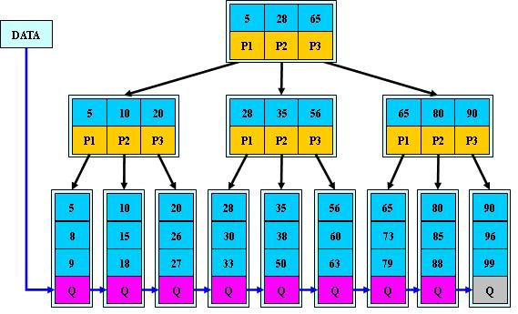

> 不可浅尝辄止

[TOC]

B-数和B+ 树是用作外部查找的数据结构，其数据存放在外存。

节点or 结点？

## B-Tree

> B树（B-tree）是一种树状数据结构，它能够存储数据、对其进行排序并允许以`O(log n)`的时间复杂度运行进行查找、顺序读取、插入和删除的数据结构。B树，概括来说是一个节点可以拥有多于`2个子节点的二叉查找树`。与自平衡二叉查找树不同，B-树为系统最优化大块数据的读和写操作。B-tree算法减少定位记录时所经历的中间过程，从而加快存取速度。普遍运用在数据库和文件系统。

时间复杂度：$O(log_d^N)$

1. 所有的叶子节点在同一层，并且不带信息
2. 树中每个节点至多有m棵子树(即至多含有m-1个关键字)
3. 若根节点不是终端节点，则根节点至少有两棵子树
4. 除根结点外，其他非叶子节点至少有$⌈m/2⌉$棵子树（即至少含有$⌈m/2⌉-1$个key）
5. 每个非叶子节点的结构为：$(n,p_0,k_1,p_1,k_2...,k_n,p_n)$

参考《数据结构第四版-李春葆》

## B+Tree

## B 树和B+ 树的差别

B+树是对B树的一种变形树，它与B树的差异在于：

[B+树](./B+树.md)：

+ B+树`非叶结点仅具有索引作用`，在叶结点中存放数据，因此在内存页能存放更多的非叶子节点。
+ 数据更加紧密，具有很好的`空间局部性`，访问叶子节点关联的数据也具有很好的`缓存命中率`
+ B+ 树的叶子节点构成`单向循环链表`，由于数据`有序且相连`，便于区间查找

B 树：

+ B树在任何节点都存放数据
+ B树搜索，需要进行每一层的递归遍历。相邻的元素可能在内存中不相邻，所以缓存命中性没有B+树好。

根据B-Tree的定义，可知检索一次最多需要访问h个节点。数据库系统的设计者巧妙利用了磁盘预读原理，将一个节点的大小设为等于一个页，这样每个节点只需要一次I/O就可以完全载入。为了达到这个目的，在实际实现B-Tree还需要使用如下技巧：

每次新建节点时，直接申请一个页的空间，这样就保证一个节点物理上也存储在一个页里，加之计算机存储分配都是按页对齐的，就实现了一个node只需一次I/O。

B-Tree中一次检索最多需要h-1次I/O（根节点常驻内存），渐进复杂度为$O(h)=O(log_d^N)$。一般实际应用中，出度d是非常大的数字，通常超过100，因此h非常小（通常不超过3）。

综上所述，用B-Tree作为索引结构效率是非常高的。

而红黑树这种结构，h明显要深的多。由于逻辑上很近的节点（父子）物理上可能很远，无法利用局部性，所以红黑树的I/O渐进复杂度也为O(h)，效率明显比B-Tree差很多。

上文还说过，B+Tree更适合外存索引，原因和内节点出度d有关。从上面分析可以看到，d越大索引的性能越好，而出度的上限取决于节点内key和data的大小：

$d_{max}=floor(pagesize/(keysize+datasize+pointsize))$
floor表示向下取整。由于B+Tree内节点去掉了data域，因此可以拥有更大的出度，拥有更好的性能。

参考：
+ [【经典数据结构】B树与B+树](https://www.cnblogs.com/vincently/p/4526560.html)

+ [MySQL索引背后的数据结构及算法原理](http://blog.codinglabs.org/articles/theory-of-mysql-index.html)

