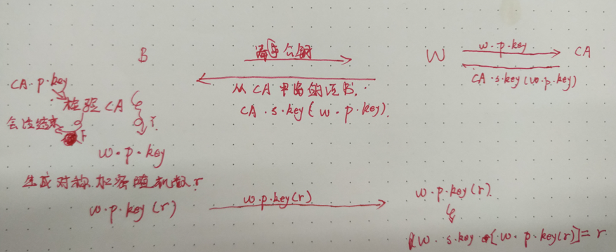

[TOC]


### Http1.0和Http1.1 的区别


#### 长连接

- Http1.0 只有请求头指定keep-alive，才能建立keepalive 连接，否则连接是一次性的。

- Http1.1 默认所有的请求是keep-alive[^1]的，除非特殊声明。Http1.1可以为服务器响应节省更多建立连接的时间来处理业务。

#### 节约带宽
- HTTP 1.1 支持只发送header信息（不带任何body，试探权限）。服务器认为有权限就返回100，否则401。客户端收到100才发送request body

#### host域支持
- HTTP 1.1 支持host域，为多host虚拟站点提供了支持。
- Http1.0 和Http1.1 主要是节省了多次进行三次握手建立连接的过程。


[^1]: HTTP persistent connection, also called HTTP keep-alive, or HTTP connection reuse, is the idea of using a single TCP connection to send and receive multiple HTTP requests/responses, as opposed to opening a new connection for every single request/response pair. The newer HTTP/2 protocol uses the same idea and takes it further to allow multiple concurrent requests/responses to be multiplexed over a single connection.


```
	Connection:keep-alive
	Host:ss0.bdstatic.com
	Pragma:no-cache
...
```

### HTTP1.1 HTTP 2.0主要区别

https://blog.csdn.net/linsongbin1/article/details/54980801

+ 多路复用
HTTP2.0使用了多路复用的技术，做到同一个连接并发处理多个请求，而且并发请求的数量比HTTP1.1大了好几个数量级。
当然HTTP1.1也可以多建立几个TCP连接，来支持处理更多并发的请求，但是创建TCP连接本身也是有开销的。
TCP连接有一个预热和保护的过程，先检查数据是否传送成功，一旦成功过，则慢慢加大传输速度。因此对应瞬时并发的连接，服务器的响应就会变慢。所以最好能使用一个建立好的连接，并且这个连接可以支持瞬时并发的请求。
关于多路复用，可以参看学习NIO 。

+ 数据压缩
HTTP1.1不支持header数据的压缩，HTTP2.0使用HPACK算法对header的数据进行压缩，这样数据体积小了，在网络上传输就会更快。

+ 服务器推送
意思是说，当我们对支持HTTP2.0的web server请求数据的时候，服务器会顺便把一些客户端需要的资源一起推送到客户端，免得客户端再次创建连接发送请求到服务器端获取。这种方式非常合适加载静态资源。
服务器端推送的这些资源其实存在客户端的某处地方，客户端直接从本地加载这些资源就可以了，不用走网络，速度自然是快很多的。


### https协议


https 可以分为两个步骤：

1. 采用非对称加密协商出对称加密 的key:r
2. 使用对称加密传输数据





+ B：Brower，W：webSerer,CA:证书机构
+ CA.p.key 表示 CA.public.key，也就是公钥
+ w.s.key 表示 webServer.secret.key,表示私钥
+ 用CA.s.key(w.p.key)表示 CA机构使用CA的私钥加密服务器的公钥
+ 用w.s.key[w.p.key(r)]=r 表示 解密


#### https: 用非对称加密协商对称加密的密码

+ 对称加密速度快，加密时CPU资源消耗少
+ 对称加密对待加密的数据的长度有比较严格的要求，不能太长


#### 如果没有CA

+ https采用非对称加密算法：公钥加密私钥解，私钥加密公钥解
+ 私钥存在于服务端，公钥存在于客户端
+ 客户端向服务端发送信息是安全的，因为私钥只有服务端拥有
+ 服务端向客户端发送信息是不安全的，因为公钥是大家都有的


#### CA 解决了公钥的安全性

获取公钥的安全性：

+ Brower在请求公钥时，可能被hacker替换掉公钥，导致Brower拿到的是h.p.key;
+ SSL 证书中包含的具体内容有证书的颁发机构、有效期、公钥、证书持有者、签名


+ 服务端的公钥经过CA的私钥加密，在传输过程中，中间人不知道CA.s.key，所以无法伪造CA.s.key(w.p.key)
+ CA 导致 w.p.key 是少数人知道的，并且无法被篡改

#### http and https
+ 安全性：
	+ http:	明文传输
	+ https: 加密传输

+ https工作流程
	+ TCP 三次握手
	+ 用非对称加密协商 对称加密的key
	+ 使用对称加密算法 通信


参考：[看完还不懂HTTPS我直播吃翔](https://zhuanlan.zhihu.com/p/25976060)